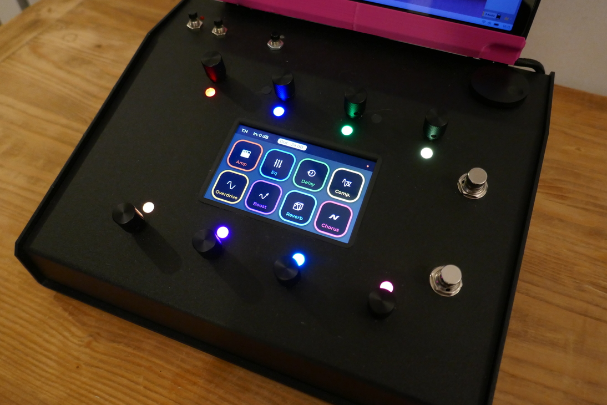
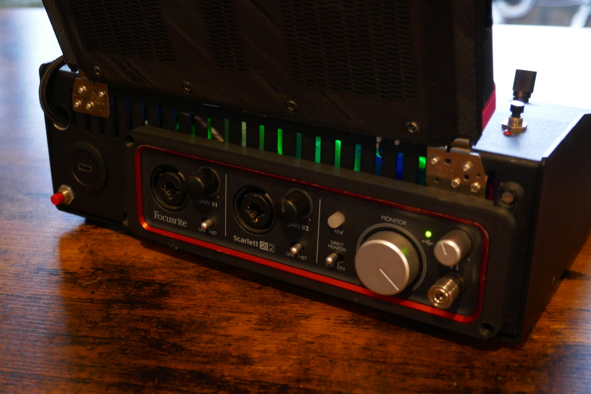
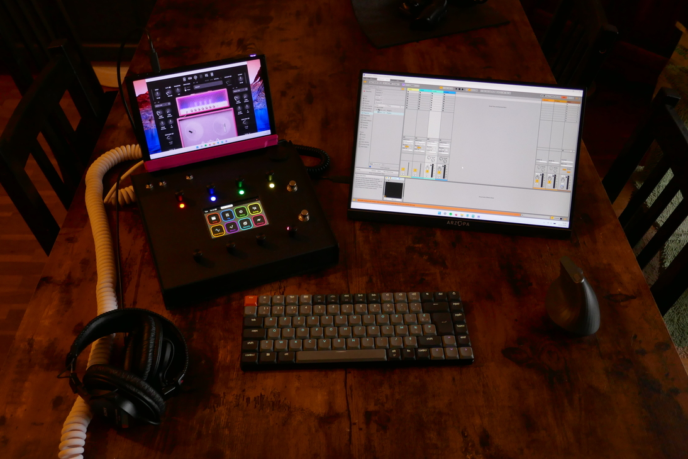
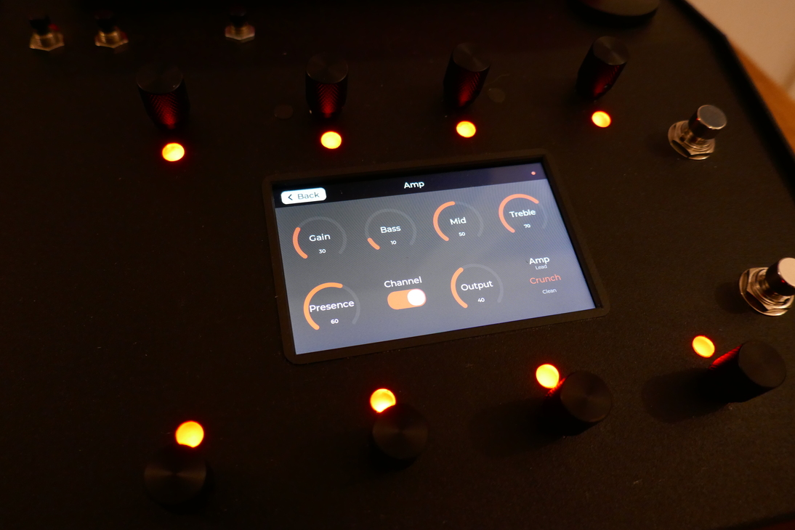
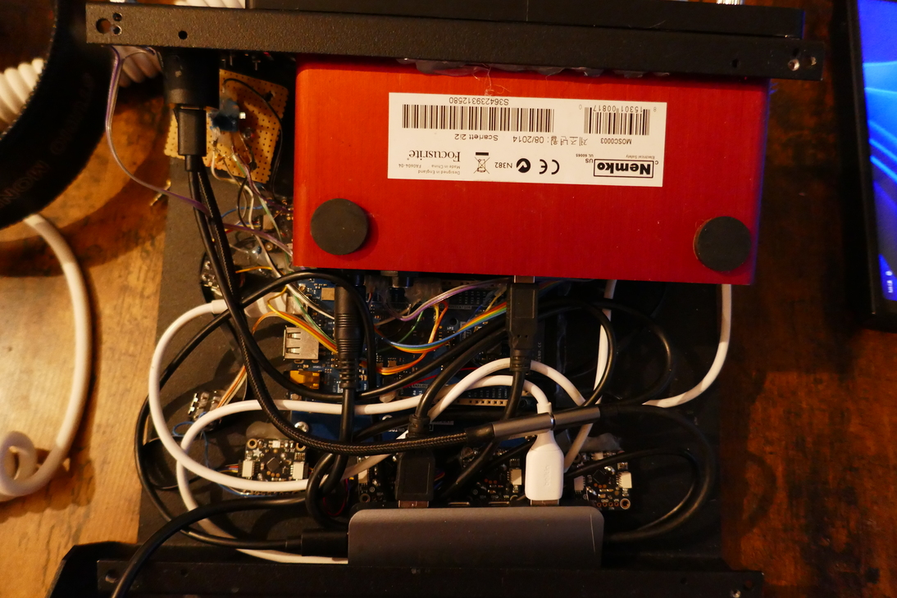
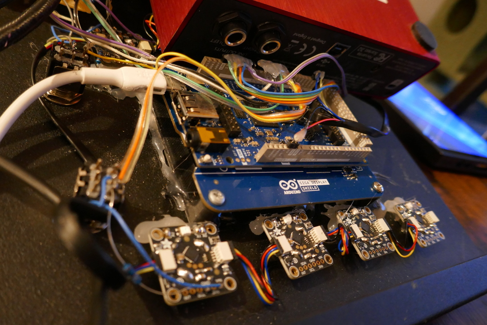

# 🎛 FourBrain Controller  
### Arduino MIDI Control Surface for Neural DSP Archetype

  
  


An open-source Arduino-based MIDI control surface for **Neural DSP Archetype** plugins with full bi-directional feedback.

Built for guitarists who want a compact, headphone-friendly setup with physical control.

**This project is not affiliated with or endorsed by Neural DSP.**

<p align="center">
  
</p>
<p align="center">
  <em>Forget Quad Cortex. Behold… FourBrain.
</em>
</p>

The enclosure contains:

- Arduino GIGA + 800x480 display
- 8 clickable rotary encoders with RGB LED rings
- 2 footswitches for preset navigation
- Additional switches for gain, doubler, etc.
- Focusrite Scarlett 2i2
- Internal USB dock → single USB-C output

A **Lenovo Legion Go** (mounted in a custom 3D-printed dock) runs the software, but any USB-C computer can be used.

Power Delivery allows the entire system to be powered and charged from a single cable. It can also run directly from the computer’s battery without external power.

<p align="center">
  
  
</p>
<p align="center">
  <em>No pedalboard. No multiple power supplies. No cable mess.</em>
</p>


---

# Why This Exists

Most MIDI foot controllers only **send** MIDI.  
They don’t receive feedback.

For example: 
- You configure a footswitch to toggle distortion. 
- LED on = distortion on, LED off = distortion off.

If you toggle the effect from your computer instead, the controller doesn’t know. The LED becomes out of sync. The same issue applies to knob values and preset changes. And what happens when you change presets? Nothing updates on the controller. All feedback becomes meaningless.
 From what I understood (and I may be wrong), even advanced MIDI controllers like the MIDI Pirate don’t provide true parameter feedback.


FourBrain behaves like a **true control surface** with bi-directional communication:

- Change something on the controller → plugin updates  
- Change something in the plugin → controller updates  

---

# Features

- Full bi-directional feedback  
- Control of major amp and pedal parameters  
- Dedicated preset navigation  
- Independent configuration for each amp  
- Input/output gain + doubler control  
- Touchscreen UI (optional)  
- Custom Ableton Remote Script  

<p align="center">
  
  
</p>
<p align="center">
  <em>Main effects screen | Amp parameter screen</em>
</p>

<p align="center">
  
  
  
</p>
<p align="center">
  <em>Preset switching | Pedal control | Full amp control demo</em>
</p>

---

# Limitations

- Currently supports **Archetype: Tim Henson**
- Plini support planned
- EQ and Multivoicer not implemented
- Mic placement not supported
- Ableton only (no standalone plugin)
- Tested on Windows 11 + Ableton Live 12
- **VST2 only**
- Preset names cannot be displayed

---

# Hardware

Chosen for fast development rather than cost optimization.
An Arduino GIGA may be overkill for this project, but it allowed fast tests with an integrated touchscreen and lvgl lib support.

Main components:

- Arduino GIGA R1 WiFi  
- GIGA Display Shield  
- Adafruit STEMMA QT Rotary Encoder Breakouts  
- Hammond 1456KH3BKBK enclosure  

Encoders are daisy-chained over I2C (D20/SDA, D21/SCL).  
The display is a direct shield for the GIGA.

<p align="center">
  
  
</p>

**TODO: Wiring diagram**

## Touchscreen Situation

The project originally supported full touchscreen control.  
It worked, until I broke it...

In the end, I realized everything I actually need can be handled perfectly with physical buttons and encoders. The touchscreen is no longer essential.
The LCD remains functional, but the touch layer is no longer required.  
Most touchscreen features still exist in the code, but some are incomplete or unstable.

The controller now works fully without touch input.

---

# How to Use

## 1️⃣ Upload Firmware

1. Clone the repository  
2. Open the `.ino` file  
3. Install required libraries  
4. Select board + COM port  
5. Upload  

---

## 2️⃣ Connect to Ableton

1. Copy the Remote Script to:
   ```
   Documents\Ableton\User Library\Remote Scripts\
   ```
2. Connect the Arduino  
3. Enable it in Ableton MIDI settings  
4. Select **FourBrain** as control surface  

---

## 3️⃣ Expose Plugin Parameters

Ableton requires plugin parameters to be exposed (~60 parameters).

To simplify the process, a default configuration file is provided. It already externalizes all required parameters and matches the plugin’s default preset layout.
If you are starting from a clean Ableton project and have not modified the default preset, simply use the provided file.

If the plugin has already been used in a project, parameters have been previously externalized, or the default preset has been modified, you will need to externalize the parameters manually to ensure proper mapping.

### Recommended (Default File)

If using a clean project:

1. Copy the provided configuration file to:
   ```
   User Library\Defaults\Plug-In Configurations\VSTs\Archetype Tim Henson X
   ```
2. Insert the plugin (VST2)  
3. Right-click → **Lock to Control Surface**

### Manual Method

1. Insert the plugin (VST2) on an audio track  
2. Click **Configure**  
3. Click each parameter you want to expose (order is not important)

To save time, externalize:

- All knobs from the three amps  
- All pedal switches  
- Input gain  
- Output gain  
- Doubler  

Do NOT externalize:

- Multivoicer  
- EQ  
- Mic placement page  

4. Save the configuration for later
5. Right-click the plugin header bar → **Lock to Control Surface**

---

## Preset Navigation

Preset arrows cannot be exposed in Ableton.

As a workaround, standard MIDI mapping is used for preset navigation (no feedback is required for this function).

1. Create a MIDI track (Channel 3)  
2. Route it to the plugin  
3. Open the plugin and right click → Enable MIDI Learn  
4. Assign switches  

## Plugin Window Toggle 

A dedicated switch can toggle the plugin window. 

1. Enable MIDI Learn in Ableton 
2. Assign the switch to the plugin window toggle button

---

# Customization

The code is not perfectly abstracted, and supporting new plugins may require structural adjustments. 
However: 
- The configuration file can be adapted to other plugins 
- UI colors are customizable 
- UI layout can be modified

 Extending beyond 8 visible controllers simultaneously would require deeper UI redesign.

 TODO: explain the configuration files
---


# Contributing

Pull requests are welcome.  
Please open an issue for major changes.

---

# Acknowledgments

Huge thanks to **tttapa** for the Arduino Control Surface library:  
https://github.com/tttapa/Control-Surface

This project would not exist without that foundation.

---

# License

MIT License.