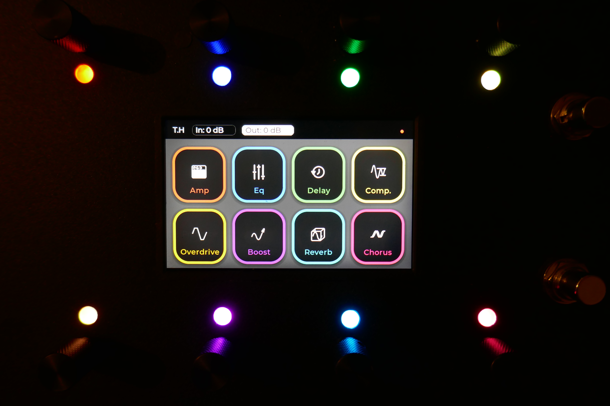
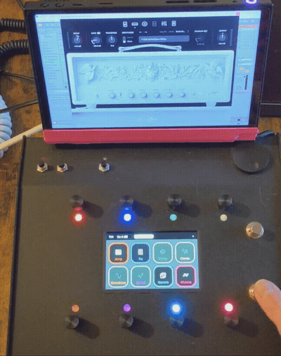

# 🎛 FourBrain Controller  
### Arduino MIDI Control Surface for Neural DSP Archetype

  
  


An open-source Arduino-based MIDI control surface for **Neural DSP Archetype** plugins with full bi-directional feedback.

Built for guitarists who want a compact, headphone-friendly setup with physical control.

**This project is not affiliated with or endorsed by Neural DSP.**

<p align="center">
  
</p>
<p align="center">
  <em>Forget Quad Cortex. Behold… FourBrain.
</em>
</p>

The enclosure contains:

- Arduino GIGA + 800x480 display
- 8 clickable rotary encoders with RGB LED rings
- 2 footswitches for preset navigation
- Additional switches for gain, doubler, etc.
- Focusrite Scarlett 2i2
- Internal USB dock → single USB-C output

A **Lenovo Legion Go** (mounted in a custom 3D-printed dock) runs the software, but any USB-C computer can be used.

Power Delivery allows the entire system to be powered and charged from a single cable. It can also run directly from the computer’s battery without external power.

<p align="center">
  
  
</p>
<p align="center">
  <em>No pedalboard. No multiple power supplies. No cable mess.</em>
</p>


---

# Why This Exists

Most MIDI foot controllers only **send** MIDI.  
They don’t receive feedback.

Result:
- LEDs go out of sync  
- Knobs don’t reflect real values  
- Preset changes break everything  

FourBrain behaves like a **true control surface** with bi-directional communication:

- Change something on the controller → plugin updates  
- Change something in the plugin → controller updates  

---

# Features

- Full bi-directional feedback  
- Control of major amp and pedal parameters  
- Dedicated preset navigation  
- Independent configuration for each amp  
- Input/output gain + doubler control  
- Touchscreen UI (optional)  
- Custom Ableton Remote Script  

<p align="center">
  
  
</p>
<p align="center">
  <em>Main effects screen | Amp parameter screen</em>
</p>

<p align="center">
  
  
  
</p>
<p align="center">
  <em>Preset switching | Pedal control | Full amp control demo</em>
</p>

---

# Limitations

- Currently supports **Archetype: Tim Henson**
- Plini support planned
- EQ and Multivoicer not implemented
- Mic placement not supported
- Ableton only (no standalone plugin)
- Tested on Windows 11 + Ableton Live 12
- **VST2 only**
- Preset names cannot be displayed

---

# Hardware

Chosen for fast development rather than cost optimization.

Main components:

- Arduino GIGA R1 WiFi  
- GIGA Display Shield  
- Adafruit STEMMA QT Rotary Encoder Breakouts  
- Hammond 1456KH3BKBK enclosure  

Encoders are daisy-chained over I2C (D20/SDA, D21/SCL).  
The display is a direct shield for the GIGA.

<p align="center">
  
  
</p>

## Touchscreen Situation

The project originally supported full touchscreen control.  
It worked — until I broke it.

The LCD remains functional, but the touch layer is no longer required.  
Most touchscreen features still exist in the code, but some are incomplete or unstable.

The controller now works fully without touch input.

---

# How to Use

## 1️⃣ Upload Firmware

1. Clone the repository  
2. Open the `.ino` file  
3. Install required libraries  
4. Select board + COM port  
5. Upload  

---

## 2️⃣ Connect to Ableton

1. Copy the Remote Script to:
   ```
   Documents\Ableton\User Library\Remote Scripts\
   ```
2. Connect the Arduino  
3. Enable it in Ableton MIDI settings  
4. Select **FourBrain** as control surface  

---

## 3️⃣ Expose Plugin Parameters

Ableton requires plugin parameters to be exposed (~60 parameters).

### Recommended (Default File)

If using a clean project:

1. Copy the provided configuration file to:
   ```
   User Library\Defaults\Plug-In Configurations\VSTs\Archetype Tim Henson X
   ```
2. Insert the plugin (VST2)  
3. Right-click → **Lock to Control Surface**

### Manual Method

1. Insert plugin (VST2)  
2. Click **Configure**  
3. Click each parameter to expose it  
4. Save the configuration  

(Not included: EQ, Multivoicer, mic placement)

---

## Preset Navigation

Preset arrows cannot be exposed in Ableton.

1. Create a MIDI track (Channel 3)  
2. Route it to the plugin  
3. Enable MIDI Learn  
4. Assign switches  

No feedback for preset arrows.

---

# Customization

- Config file can be adapted to other plugins  
- UI colors are editable  
- Layout can be modified  

Supporting more than 8 visible controllers would require UI redesign.

---

# Contributing

Pull requests are welcome.  
Please open an issue for major changes.

---

# Acknowledgments

Huge thanks to **tttapa** for the Arduino Control Surface library:  
https://github.com/tttapa/Control-Surface

This project would not exist without that foundation.

---

# License

MIT License.